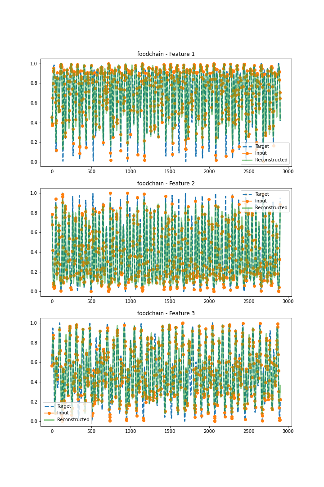
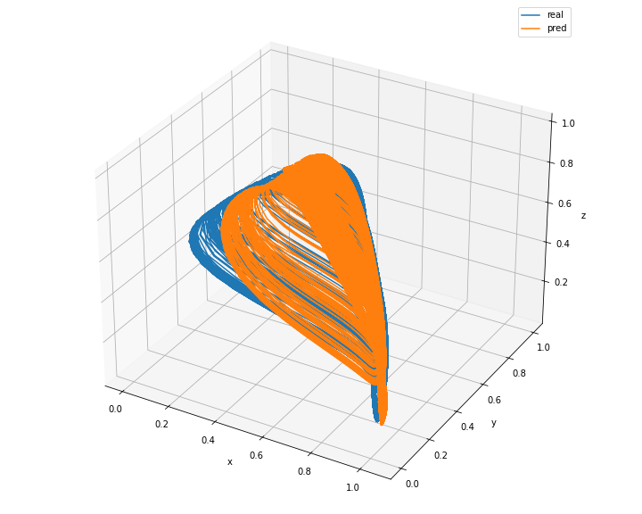
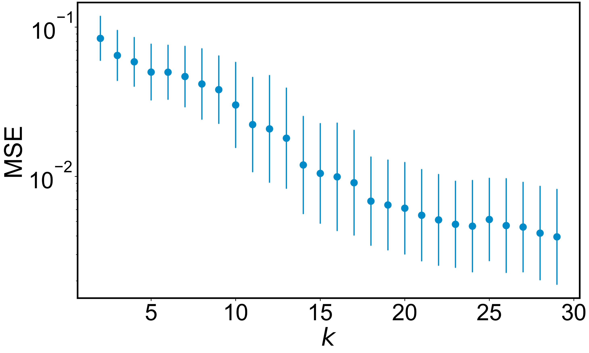

<h1 align="center">Reconstructing dynamics from sparse observations with no training on target system</h1>

<p align="center">

</p>

This repo is for our preprint [Reconstructing dynamics from sparse observations with no training on target system](https://arxiv.org/abs/2410.21222), where dynamics be faithfully reconstructed from the limited observations without any training data. This framework provides a paradigm of reconstructing complex and nonlinear dynamics in the extreme situation where training data does not exist and the observations are random and sparse.

<p align="center">

</p>

We address this challenge by developing a hybrid transformer and reservoir-computing machine-learning scheme. For a complex and nonlinear target system, the training of the transformer can be conducted not using any data from the target system, but with essentially unlimited synthetic data from known chaotic systems. The trained transformer is then tested with the sparse data from the target system. The output of the transformer is further fed into a reservoir computer for predicting the long-term dynamics or the attractor of the target system. 

# Simulation guidance

Download the time series data of all chaotic systems from [Zenodo](https://doi.org/10.5281/zenodo.14014975) and move them to the 'chaos_data' folder. You can also generate the chaotic data by running `save_chaos.py`. To proceed with the machine learning code, either download the data and move it to the 'chaos_data' folder or generate the data yourself.

Run `chaos_transformer_read_and_test.py` to evaluate the trained model on testing (target) systems, with sequence length $L_s=2000$ and sparisty ratio $S_r=0.8$. It is important to note that the model has not encountered the testing systems during training. An example of reconstructed chaotic foodchain system is shown below:
<p align="center">

</p>

Afterward, execute `rc_prediction.py` to use the Transformer-reconstructed data to make both short-term and long-term predictions:

<p align="center">

</p>

In addition to use our trained model, we also provide code `chaos_transformer_train.py` for readers to train the transformer by themselves. After training, please remember to change the 'save_file_name' in `chaos_transformer_read_and_test.py` to your saved model file name to ensure the use of your own trained model when doing testing. A jupiter notebook is provided in Examples file, to help readers understand the code.

Furthermore, the readers can also generate more diverse synthetic systems for training, to improve the dyanmics reconstruction performance on unseen target systems in the testing phase. The performance decrease follows a power-law relationship with respect to the training systems:

<p align="center">

</p>


# More information

- For more information about the hyperparameters optimization, you can find from my [GitHub page](https://github.com/Zheng-Meng/Reservoir-Computing-and-Hyperparameter-Optimization).

# Cite our work
```
@article{zhai2024reconstructing,
  title={Reconstructing dynamics from sparse observations with no training on target system},
  author={Zhai, Zheng-Meng and Huang, Jun-Yin and Stern, Benjamin D. and Lai, Ying-Cheng},
  journal={arXiv preprint arXiv:2410.21222},
  year={2024}
}
```


