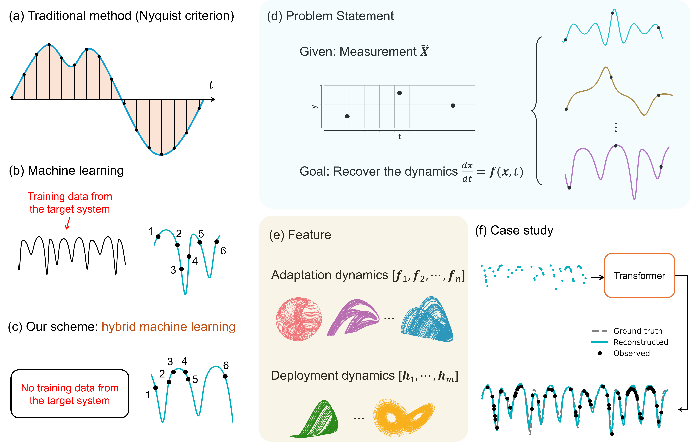
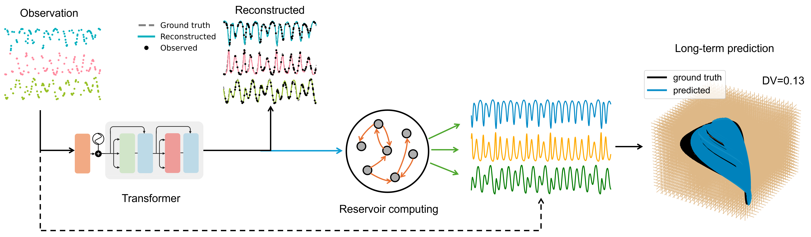

<h1 align="center">Reconstructing dynamics from sparse observations with no training on target system</h1>

This repo is for our preprint [Reconstructing dynamics from sparse observations with no training on target system](https://arxiv.org/abs/2410.21222), where dynamics be faithfully reconstructed from the limited observations without any training data. This framework provides a paradigm of reconstructing complex and nonlinear dynamics in the extreme situation where training data does not exist and the observations are random and sparse.

We address this challenge by developing a hybrid transformer and reservoir-computing machine-learning scheme. For a complex and nonlinear target system, the training of the transformer can be conducted not using any data from the target system, but with essentially unlimited synthetic data from known chaotic systems. The trained transformer is then tested with the sparse data from the target system. The output of the transformer is further fed into a reservoir computer for predicting the long-term dynamics or the attractor of the target system. 

