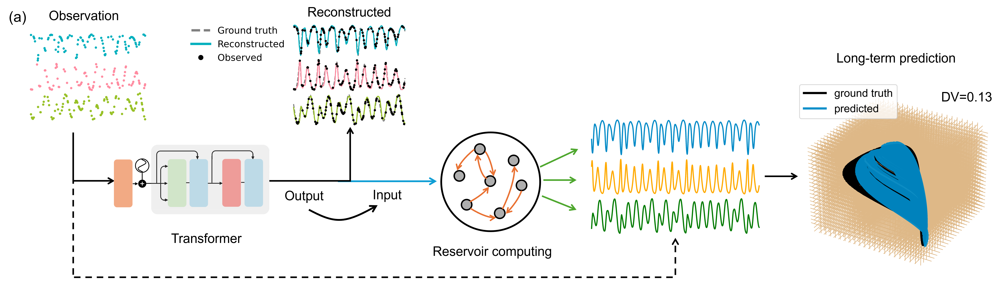
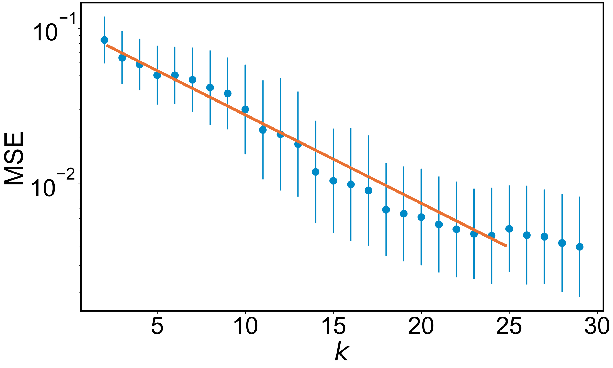

<h1 align="center">Reconstructing dynamics from sparse observations with no training on target system</h1>

<p align="center">

</p>

This repo is for our preprint [Reconstructing dynamics from sparse observations with no training on target system](https://arxiv.org/abs/2410.21222), where dynamics be faithfully reconstructed from the limited observations without any training data. This framework provides a paradigm of reconstructing complex and nonlinear dynamics in the extreme situation where training data does not exist and the observations are random and sparse.

<p align="center">

</p>

We address this challenge by developing a hybrid transformer and reservoir-computing machine-learning scheme. For a complex and nonlinear target system, the training of the transformer can be conducted not using any data from the target system, but with essentially unlimited synthetic data from known chaotic systems. The trained transformer is then tested with the sparse data from the target system. The output of the transformer is further fed into a reservoir computer for predicting the long-term dynamics or the attractor of the target system. 

# Simulation guidance

Download the time series data of all chaotic systems from [Zenodo](https://doi.org/10.5281/zenodo.14014975) and move them to the 'chaos_data' folder. You can also generate the chaotic data by running `save_chaos.py`. To proceed with the machine learning code, either download the data and move it to the 'chaos_data' folder or generate the data yourself.

Run `chaos_transformer_read_and_test.py` to evaluate the trained model on testing (target) systems, with sequence length $L_s=2000$ and sparisty ratio $S_r=0.8$. It is important to note that the model has not encountered the testing systems during training. An example of reconstructed chaotic foodchain system is shown below:
<p align="center">

</p>

Afterward, execute `rc_prediction.py` to use the Transformer-reconstructed data to make both short-term and long-term predictions:

<p align="center">

</p>

In addition to using our pre-trained model, we also provide the script chaos_transformer_train.py for readers to train the transformer themselves. After training, please ensure that the 'save_file_name' variable in chaos_transformer_read_and_test.py is updated to match your saved model file name, so that your own trained model is used during testing. A Jupyter notebook is provided in the examples folder to help readers understand and reproduce the code workflow.

Furthermore, readers may generate more diverse synthetic systems for training, which can enhance reconstruction performance on previously unseen target systems during testing. The performance degradation follows a power-law relationship with respect to the diversity of training systems:

<p align="center">

</p>


# More information

- For more information about the reservoir hyperparameters optimization, you can find from my [GitHub page](https://github.com/Zheng-Meng/Reservoir-Computing-and-Hyperparameter-Optimization).

If you have any questions or suggestions, feel free to reach out.


# Cite our work
```
@article{zhai2024reconstructing,
  title={Reconstructing dynamics from sparse observations with no training on target system},
  author={Zhai, Zheng-Meng and Huang, Jun-Yin and Stern, Benjamin D. and Lai, Ying-Cheng},
  journal={arXiv preprint arXiv:2410.21222},
  year={2024}
}
```


